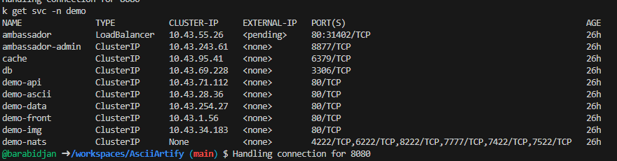
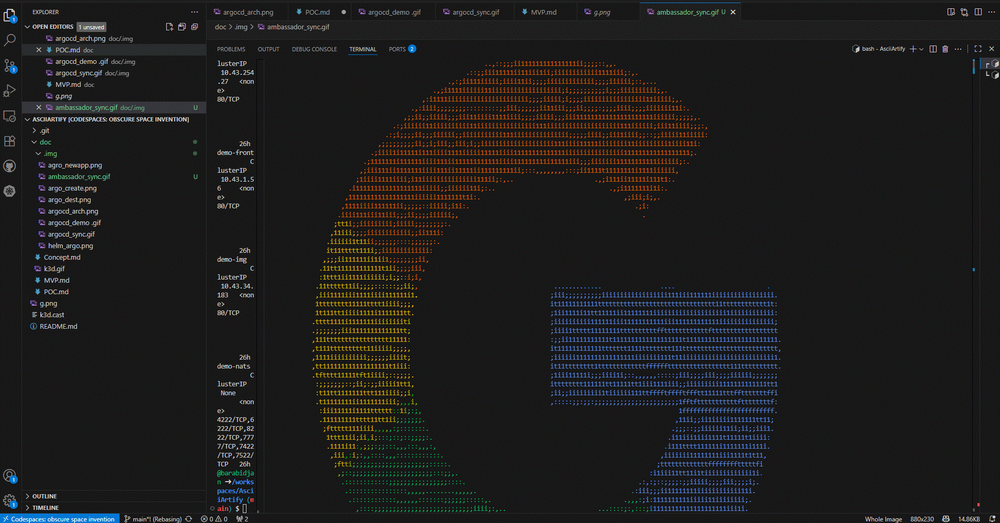

# Minimum Viable Product (MVP):

`Ціль:` Створити мінімальний функціональний продукт, який може вивести на ринок та отримати зворотний зв'язок від користувачів. В нашому випадку це демонтрація роботи застосунку `AsciiArtify`

`Зміст документації:` Визначення функціональних вимог, дизайн інтерфейсу, технічну архітектуру, план виконання, тестовий план, план масштабування та стратегію впровадження.

1. Перевіряємо роботу застосунку AsciiArtify
- Переадресуємо порти наступною командою:
```bash
$ k port-forward -n demo svc/ambassador 8081:80&
Forwarding from 127.0.0.1:8081 -> 80
Forwarding from [::1]:8081 -> 80
```
- Зробимо запит на вказаний порт та отримаємо відповідь у вигляді версії додатку:  
```bash
$ curl localhost:8081
k8sdiy-api:599e1af#       
```
- Наче все добре, але  ArgoCD з цим не згоден, швидше за все помилка в конфігарійних файлах

2. Виравлення проблеми з конфігураційними файлами
- після попередніх експериментів перевіримо мережеві налаштування нашого застосунку:
```bash
$ k get svc -n demo
NAME               TYPE           CLUSTER-IP     EXTERNAL-IP   PORT(S)                                                 AGE
ambassador         LoadBalancer   10.43.55.26    <pending>     80:31402/TCP                                            26h
ambassador-admin   ClusterIP      10.43.243.61   <none>        8877/TCP                                                26h
cache              ClusterIP      10.43.95.41    <none>        6379/TCP                                                26h
db                 ClusterIP      10.43.69.228   <none>        3306/TCP                                                26h
demo-api           ClusterIP      10.43.71.112   <none>        80/TCP                                                  26h
demo-ascii         ClusterIP      10.43.28.36    <none>        80/TCP                                                  26h
demo-data          ClusterIP      10.43.254.27   <none>        80/TCP                                                  26h
demo-front         ClusterIP      10.43.1.56     <none>        80/TCP                                                  26h
demo-img           ClusterIP      10.43.34.183   <none>        80/TCP                                                  26h
demo-nats          ClusterIP      None           <none>        4222/TCP,6222/TCP,8222/TCP,7777/TCP,7422/TCP,7522/TCP   26h
```
- заглянемо в інтерфейс ArgoCD, де відразу помітимо що стан здоров'я нашого додатку `ambassador` невизначено, отже копаємо сюди.

  
- В [репозиторії з конфігураційними файлами helm](https://github.com/barabidjan/go-demo-app/blob/master/helm/values.yaml) виправимо тип `api-gateway:` на `NodePort`

- За допомогою ArgoCD виявимо зміни в конфігурації та застосоємо їх до продуктивної версії нашого застосунку

- Перевіримо зміни:
```bash
$ k get svc -n demo
NAME               TYPE        CLUSTER-IP     EXTERNAL-IP   PORT(S)                                                 AGE
ambassador         NodePort    10.43.55.26    <none>        80:31402/TCP                                            26h
ambassador-admin   ClusterIP   10.43.243.61   <none>        8877/TCP                                                26h
cache              ClusterIP   10.43.95.41    <none>        6379/TCP                                                26h
db                 ClusterIP   10.43.69.228   <none>        3306/TCP                                                26h
demo-api           ClusterIP   10.43.71.112   <none>        80/TCP                                                  26h
demo-ascii         ClusterIP   10.43.28.36    <none>        80/TCP                                                  26h
demo-data          ClusterIP   10.43.254.27   <none>        80/TCP                                                  26h
demo-front         ClusterIP   10.43.1.56     <none>        80/TCP                                                  26h
demo-img           ClusterIP   10.43.34.183   <none>        80/TCP                                                  26h
demo-nats          ClusterIP   None           <none>        4222/TCP,6222/TCP,8222/TCP,7777/TCP,7422/TCP,7522/TCP   26h
```

3. Перевіримо роботу застосунка після виправлення помилки
- Скачуємо довільний графічний файл з інтеренету та поміщаємо у локальне сховище: 
```bash
wget -O /tmp/g.png https://cdn.pixabay.com/photo/2017/01/19/09/11/logo-google-1991840_960_720.png
```
- Для цього завантажимо файл що зберігається у нас в локальному сховищі на вітдалений сервер командою:
```bash
curl -F 'image=@g.png' localhost:8081/img/
```
- Отримаємо результат прямо в консолі:  

  

4. Зафіксуємо весь описаний процес в наглядному форматі для демонстрації на відео:


