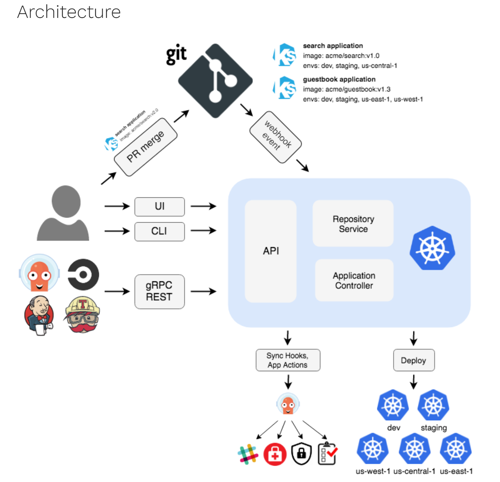
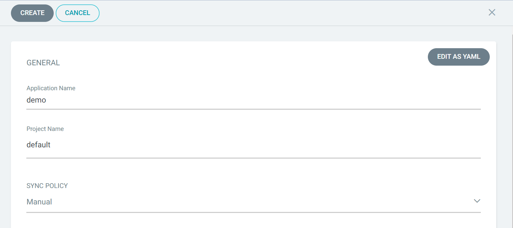
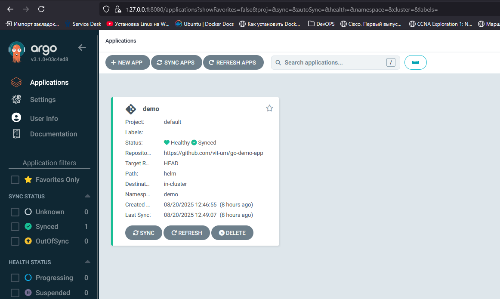

## Proof of Concept. ArgoCD deployment

`Ціль:`Довести технічну чи концептуальну життєздатність ідеї та концепції застосування ArgoCD в якості інструменту CD. Доведемо, що є технічно можливим реалізувати цю ідею.

`Зміст документації:` На цьому етапі документація може містити опис концепції, аналіз технічних можливостей, визначення обраного стеку технологій, короткий план виконання, технічні сценарії та метрики успіху PoC.

В цьому розділі буде розглянуто набір інструментів для розгортання застосунків будь якої складності. Почнемо з підготовленого [репозиторію](https://github.com/barabidjan/AsciiArtify) та напишемо трохи коду для автоматизації всього процесу `CI` від білда до артефакту. Після цього у нас виникають ще варіанти інструментів для етапу `CD`  

Delivery ми організуємо за моделлю `pull` або втягування змін з репозиторію. Виберемо підхід "one application - one cluster", тоб-то для кожного додатку буде взятий один окремий кластер. З цією метою використаємо "single host kubernetes cluster" А в якості системи Delivery та Deploy на тестове оточення виберемо [ArgoCD](https://argo-cd.readthedocs.io/en/stable/).  

  

`ArgoCD` реалізує підхід GitOps використовуючи репозиторій Git як джерело істини для визначення бажаного стану програми. Маніфести Kubernetes можна вказувати кількома способами:  
- [kustomize](https://kustomize.io/) applications  
- [helm](https://helm.sh/) charts
- [jsonnet](https://jsonnet.org/) files
- Plain directory of YAML/json manifests  

`ArgoCD`- це контролер Kubernetes який безперервно відстежує запущені додатки та порівнює поточний стан з бажаним. Деплоймент поточній стан якого відрізняється від цільового вважається `out of sync` ArgoCD інформує та візуалізує відмінності надаючи можливості для автоматичної або ручної синхронізації бажаного стану. 

1. Підготуємо в окремий локальний кластер для встановлення ArgoCD. Налаштуємо його:  
```bash
$ k3d cluster create argo
... 
INFO[0029] Cluster 'argo' created successfully!         
INFO[0029] You can now use it like this: kubectl cluster-info


$ kubectl cluster-info 
Kubernetes control plane is running at https://0.0.0.0:41327
CoreDNS is running at https://0.0.0.0:41327/api/v1/namespaces/kube-system/services/kube-dns:dns/proxy
Metrics-server is running at https://0.0.0.0:41327/api/v1/namespaces/kube-system/services/https:metrics-server:https/proxy

$ k version
$ k get all -A
```


2. Інсталяція ArgoCD можна встановити за допомогою Helm, але зараз використаємо скрипт з офіційного репозиторію ArgoCD Спочатку створимо неймспейс в якому буде встановлено систему, потім скористаємось скриптом (маніфестом) для інсталяції та перевіримо стан системи після встановлення:
```bash
$ kubectl create namespace argocd

$ kubectl get ns
NAME              STATUS   AGE
argocd            Active   127m
default           Active   129m
demo              Active   84m
kube-node-lease   Active   129m
kube-public       Active   130m
kube-system       Active   130m

$ kubectl apply -n argocd -f https://raw.githubusercontent.com/argoproj/argo-cd/stable/manifests/install.yaml
$ kubectl get all -n argocd
NAME                                                    READY   STATUS    RESTARTS   AGE
pod/argocd-application-controller-0                     1/1     Running   0          125m
pod/argocd-applicationset-controller-5c467cd4d7-t666g   1/1     Running   0          125m
pod/argocd-dex-server-798f56d9cb-s44jn                  1/1     Running   0          125m
pod/argocd-notifications-controller-6bd57db686-qt7kl    1/1     Running   0          125m
pod/argocd-redis-5d6445b58d-cwnsl                       1/1     Running   0          125m
pod/argocd-repo-server-746cbc4697-zjq85                 1/1     Running   0          125m
pod/argocd-server-6987d866f9-2q57v                      1/1     Running   0          125m

NAME                                              TYPE        CLUSTER-IP      EXTERNAL-IP   PORT(S)                      AGE
service/argocd-applicationset-controller          ClusterIP   10.43.39.86     <none>        7000/TCP,8080/TCP            125m
service/argocd-dex-server                         ClusterIP   10.43.205.86    <none>        5556/TCP,5557/TCP,5558/TCP   125m
service/argocd-metrics                            ClusterIP   10.43.241.181   <none>        8082/TCP                     125m
service/argocd-notifications-controller-metrics   ClusterIP   10.43.112.133   <none>        9001/TCP                     125m
service/argocd-redis                              ClusterIP   10.43.118.128   <none>        6379/TCP                     125m
service/argocd-repo-server                        ClusterIP   10.43.32.16     <none>        8081/TCP,8084/TCP            125m
service/argocd-server                             ClusterIP   10.43.123.64    <none>        80/TCP,443/TCP               125m
service/argocd-server-metrics                     ClusterIP   10.43.222.29    <none>        8083/TCP                     125m

NAME                                               READY   UP-TO-DATE   AVAILABLE   AGE
deployment.apps/argocd-applicationset-controller   1/1     1            1           125m
deployment.apps/argocd-dex-server                  1/1     1            1           125m
deployment.apps/argocd-notifications-controller    1/1     1            1           125m
deployment.apps/argocd-redis                       1/1     1            1           125m
deployment.apps/argocd-repo-server                 1/1     1            1           125m
deployment.apps/argocd-server                      1/1     1            1           125m

NAME                                                          DESIRED   CURRENT   READY   AGE
replicaset.apps/argocd-applicationset-controller-5c467cd4d7   1         1         1       125m
replicaset.apps/argocd-dex-server-798f56d9cb                  1         1         1       125m
replicaset.apps/argocd-notifications-controller-6bd57db686    1         1         1       125m
replicaset.apps/argocd-redis-5d6445b58d                       1         1         1       125m
replicaset.apps/argocd-repo-server-746cbc4697                 1         1         1       125m
replicaset.apps/argocd-server-6987d866f9                      1         1         1       125m

NAME                                             READY   AGE
statefulset.apps/argocd-application-controller   1/1     125m

# перевіримо статус контейнерів: 
$ kubectl get po -n argocd -w
NAME                                                READY   STATUS    RESTARTS   AGE
argocd-application-controller-0                     1/1     Running   0          128m
argocd-applicationset-controller-5c467cd4d7-t666g   1/1     Running   0          128m
argocd-dex-server-798f56d9cb-s44jn                  1/1     Running   0          128m
argocd-notifications-controller-6bd57db686-qt7kl    1/1     Running   0          128m
argocd-redis-5d6445b58d-cwnsl                       1/1     Running   0          128m
argocd-repo-server-746cbc4697-zjq85                 1/1     Running   0          128m
argocd-server-6987d866f9-2q57v                      1/1     Running   0          128m
```

3. Отримаємо доступ до інтерфейсу ArgoCD GUI
[Отримати доступ](https://argo-cd.readthedocs.io/en/stable/getting_started/#3-access-the-argo-cd-api-server) можна в два шляхи:  
- Service Type Load Balancer  
- Ingress  
- Port Forwarding

Скористаємось `Port Forwarding` за допомогою локального порта 8080. В команді ми посилаємось на сервіс `svc/argocd-server` який знаходиться в namespace `-n argocd`. Kubectl автоматично знайде endpoint сервісу та встановить переадресацію портів з локального порту 8080 на віддалений 443 
```bash
$ kubectl port-forward svc/argocd-server -n argocd 8080:443&
[1] 21887
Forwarding from 127.0.0.1:8080 -> 8080
Forwarding from [::1]:8080 -> 8080
Handling connection for 8080
```
ArgoCD за замовчуванням працює з https тому при спробі відкрити [127.0.0.1:8080](https://127.0.0.1:8080/) ми отримаємо помилку сертифікати. Отже в продуктивній системі потрібно встановлювати сертифікати та налаштовувати ці моменти.

4. Отримання паролю 
Використаємо команду для отримання паролю, вкажемо файл сікрету `argocd-initial-admin-secret` а також формат  виводу `jsonpath="{.data.password}"`. Це поверне нам base64 закодований пароль, після чого використаємо команду `base64 -d` для повернення паролю в простий текст. Отриманий пароль та логін `admin` вводимо в Web-інтерфейс ArgoCD   
```bash
$ k -n argocd get secret argocd-initial-admin-secret -o jsonpath="{.data.password}"
d0Itc25sclJNMzlEMjJDeA==

$ k -n argocd get secret argocd-initial-admin-secret -o jsonpath="{.data.password}"|base64 -d;echo
wB-snlrRM39D22Cx
```

5. Створимо додаток за допомогою графічного інтерфейсу. 
Тепер налаштовані в ArgoCD додатки будуть автоматично встановлюватись на оновлятись в Kubernetes. 
- Натискаємо `+ NEW APP` 
- Вводимо ім'я додатку `demo`
- Проект до якого належить додаток оберемо `за замовчуванням`
- Тип синхронізації залишаємо `Manual`
  
- У розділі `SOURCE` тип джерела залишаємо за замовчуванням `GIT`
- Введемо `url` репозиторію, який містить маніфести для розгортання https://github.com/barabidjan/go-demo-app (це буде helm charts, або пакет маніфестів який являє собою групу об'єктів для Kubernetes та нашого додатку)
- У полі `Path` введемо шлях до каталогу `helm`  
  
- В розділі `DESTINATION` вкажемо `url` локального кластеру та `Namespace` demo після чого ArgoCD автоматично визначить параметри додатку використавши маніфести, які знаходяться в репозиторії. В разі бажання змінити значення вручну можна змінити іх значення в розділі `PARAMETERS`.  
  
- У розділі політика синхронізація вкажемо як додаток буде синхронізуватись з репозиторієм. Тут важливо вказати ArgoCD щоб створив новий namespace так як в helm цю функцію за замовчуванням прибрали. Ставимо галку напроти `AUTO-CREATE NAMESPACE`   
- Створюємо додаток кнопкою `CREATE`  
  

6. Переглянемо деталі розгорнутого застосунку натиснувши на нього в списку.  
Графічний інтерфейс надає ієрархічне уявлення про компоненти програми, їх розгортання та поточний стан у кластері. 

  

7. Синхронізація застосунку 
- Для цього у вікні відомостей про програму натискаємо кнопку `SYNC` 
- Праворуч вискакує вікно в якому потрібно обрати компоненти та режими синхронізації та натиснути кнопку `SYNCHRONIZE`  
- Після завершення процесу можемо перевірити правильність розгортання програми, перевіривши її статус у кластері:  

  

8. Прослідкуємо за реакцією ArgoCD на зміни в репозиторію.
- Змінимо в файлі репозиторію https://github.com/vit-um/go-demo-app/blob/master/helm/values.yaml тип шлюзу з `NodePort` на `LoadBalancer` (останній рядок файлу)  


